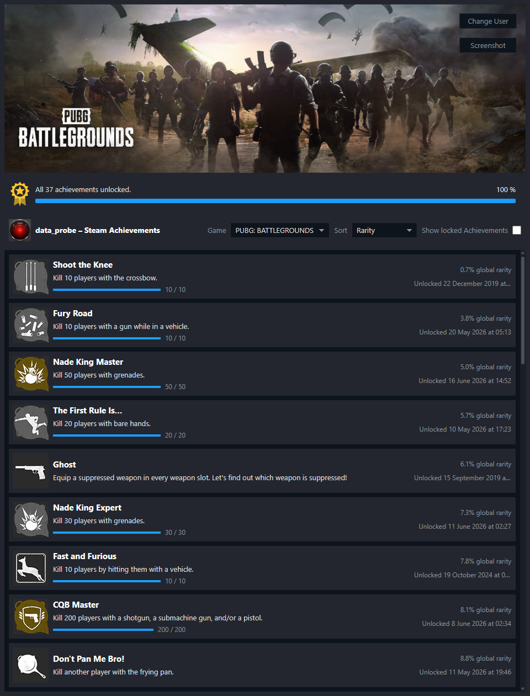

# Steam Achievement Browser

  
  ✨ Try <a href="https://steam-achievement-browser.steam-achievement-browser.workers.dev/"><b>Steam Achievements Browser</b></a> ✨

Browse and sort your Steam achievements for any publicly visible Steam library.

- Enter a **SteamID64**, **Steam profile URL**, or **vanity identifier**, then choose **Continue** or press Enter to
  access yours or anyone else's publicly visible Steam Library. No Steam sign-in is required.
  - The application reads only public Steam data, so the profile's `Game details` privacy setting must be public.
  - If the profile's `Game details` privacy setting is set to private, no game or achievement data will be accessible.

- Choose a game from the dropdown menu, then sort achievements by rarity, name, or unlock date.

- Locked achievements can be filtered with the `Show Locked Achievements` checkbox.

- Save achievements as a PNG image with the `Screenshot` button.

## 📜 License

Released under the [MIT License](LICENSE) — Copyright © 2026 Rohin Gosling.

Steam and the Steam logo are trademarks and/or registered trademarks of Valve Corporation. Game names, achievement
names, descriptions, icons, and artwork remain the property of their respective owners. This is an independent,
unofficial project and is not affiliated with or endorsed by Valve Corporation or any game publisher.
